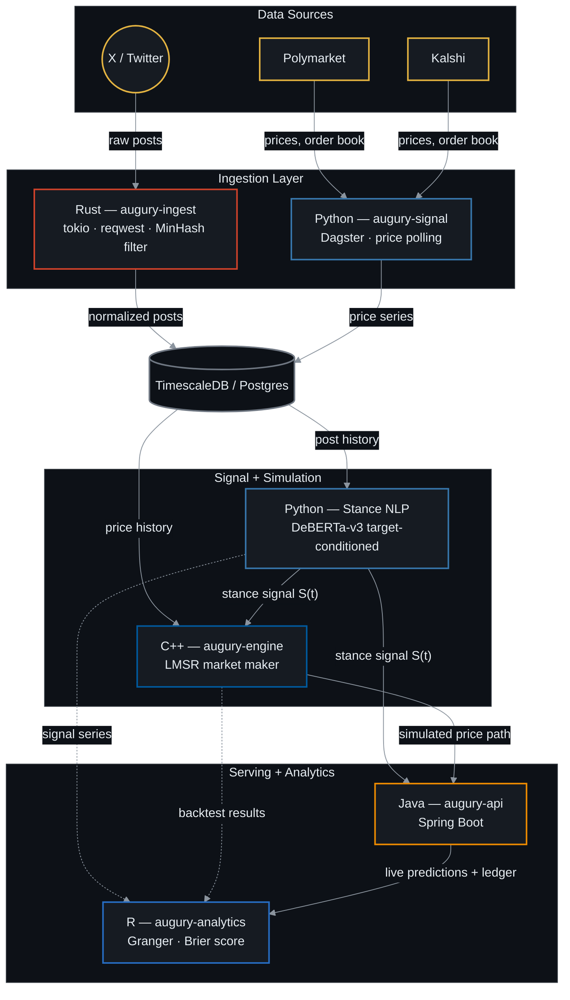

# Augury - Correlating Social Momentum with Prediction Markets

[](https://opensource.org/licenses/MIT)
[](https://www.rust-lang.org/)
[](https://www.python.org/)
[](https://isocpp.org/)
[](https://www.oracle.com/java/)
[](https://www.r-project.org/)

*Augury* is a quantitative pipeline designed to test whether social media sentiment leads or lags real-world prediction markets. It continuously streams and filters live posts from X (Twitter), processes the raw text into time-decayed stance probabilities, and maps those social signals against live order-book shifts from Polymarket and Kalshi to evaluate information efficiency.

Beyond simple observation, the system operates in two distinct modes. The statistical core evaluates Granger causality to see if social momentum actually predicts market movement, while a high-performance synthetic market engine uses Hanson's Logarithmic Market Scoring Rule (LMSR) to simulate automated market maker (AMM) behavior based on those same NLP signals. The entire system is orchestrated across a distributed, polyglot architecture utilizing Rust, Python, C++, Java, and R to handle data ingestion, modeling, simulation, and serving at scale.

The engine operates in two modes:

1. **Sentiment vs. Real Market Dynamics** — evaluates lead-lag relationships, information efficiency, and price-predictive signals between X data and actual order book shifts.
2. **Synthetic LMSR Market Engine** — simulates automated market maker (AMM) behavior using Hanson's Logarithmic Market Scoring Rule, driven by real-time NLP stance signals.

**A word on what this project is for.** The hypothesis under test — that public social sentiment carries information a liquid prediction market has not already priced — is one that efficient markets should mostly falsify. The pipeline is therefore built to report a null result cleanly rather than to search for a specification that avoids one. Several design decisions below exist specifically to make "no relationship" a reachable conclusion.

#### Contents

- [Project Status](#project-status)
- [Architecture Overview](#architecture-overview)
- [Language Responsibilities](#language-responsibilities)
- [Mathematical Foundations](#mathematical-foundations)
- [High-Value Enhancements Included](#high-value-enhancements-included)
- [Repository Structure](#repository-structure)
- [Getting Started](#getting-started)
- [Testing](#testing)
- [Roadmap & Implementation Phases](#roadmap--implementation-phases)
- [Known Gaps](#known-gaps)
- [Potential Extensions](#potential-extensions)
- [Disclaimer](#disclaimer)

---

## Project Status

All seven phases are implemented. Three of the five services have been executed and tested on the development machine; two are written but have never been compiled, because the toolchain to do so is not available there. That distinction is worth stating plainly — uncompiled code is unverified code.

| Service | Language | Status | Evidence |
|---|---|---|---|
| `augury-signal` | Python 3.12 | **Runs, tested** | 139 pytest tests, ruff clean, live end-to-end slice against Kalshi |
| `augury-api` | Java 25 | **Needs JDK 25** | 9 JUnit tests passed under JDK 21; `pom.xml` now targets 25 |
| `augury-analytics` | R 4.6 | **Runs, tested** | 55 testthat tests |
| `augury-ingest` | Rust 1.97 | **Not compiled** | blocked by Smart App Control — see [docs/BUILD.md](docs/BUILD.md) |
| `augury-engine` | C++20 | **Not compiled** | no C++ compiler installed — see [docs/BUILD.md](docs/BUILD.md) |

**Cross-language correctness.** The LMSR, decay, and calibration math is implemented independently in Python, C++, and R. All three are checked against one shared set of fixed inputs and expected outputs in [`schemas/testdata/golden_vectors.json`](schemas/testdata/golden_vectors.json), generated from the Python reference by `python -m augury_signal.golden`. Python and R currently agree to 1e-9; the C++ suite asserts the same vectors and will close the loop once it compiles. Independent implementations of a formula agree only by luck unless something forces the issue, and that file is the forcing function.

**You can run the pipeline today without Docker.** `augury slice` executes the whole chain — poll, ingest, score, aggregate, simulate, analyze — in memory and prints a report. See [Getting Started](#getting-started).

---

## Architecture Overview

The diagram below traces the full data flow, top to bottom: raw posts and market prices arrive at the top, get normalized and stored, pass through stance modeling and market simulation, and come out the other side as live predictions and statistical reports.



*Renders automatically on GitHub — no separate image file needed. Amber nodes are external data sources; every other color maps to a language in the table below.*

### Cross-service contracts

Services communicate through two boundaries, both explicit:

- **TimescaleDB** is the durable record. The schema in [`docker/migrations/`](docker/migrations/) is shared by all five languages; a market is keyed everywhere as `<venue>:<ticker>` (e.g. `kalshi:KXFEDDECISION-26SEP-C25`).
- **Redis pub/sub** carries live updates on `augury.signal.<market_id>`, `augury.price.<market_id>`, and `augury.sim.<market_id>`. Payloads are validated against the JSON Schemas in [`schemas/`](schemas/) *at the publisher* — the C++ and Java consumers are separately compiled and cannot be type-checked against Python, so the schema is the only thing holding the contract together.

Redis is a convenience, not a dependency: an outage degrades the live stream while ingestion, scoring, and the REST API keep working off the database.

---

## Language Responsibilities

| Language | Module | Core Functionality | Key Stack / Libraries |
|---|---|---|---|
| **Rust** | `augury-ingest` | Fault-tolerant ingestion of X posts, MinHash + LSH near-duplicate detection, bot filtering, persisted daily read budget. | `tokio`, `reqwest`, `serde`, `sqlx` |
| **Python** | `augury-signal` | Kalshi/Polymarket polling, target-conditioned DeBERTa-v3 stance classification, S(t) aggregation, reference LMSR, Dagster orchestration. | `transformers`, `torch`, `dagster`, `pandas`, `statsmodels` |
| **C++20** | `augury-engine` | High-performance LMSR market maker, walk-forward backtesting, depth-calibrated liquidity. | `CMake`, `Catch2`, `nlohmann/json` |
| **Java** | `augury-api` | Reactive REST gateway, live paper-trading portfolio state, streaming WebSockets. | `Spring Boot 3`, `Project Reactor`, Java records |
| **R** | `augury-analytics` | Econometric validation, lead-lag cross-correlations, Brier score calibration, Quarto reports. | `tidyverse`, `tseries`, `vars`, `ggplot2`, `quarto`, `testthat` |

---

## Mathematical Foundations

### 1. Stance-Weighted Exponential Time-Decay Signal

Raw sentiment is insufficient for prediction markets; Augury extracts target-specific stance $\text{Stance}_i \in [-1, 1]$ (Bearish to Bullish) for event $E$. The aggregate social signal $S(t)$ at time $t$ uses half-life decay $\lambda$:

$$S(t) = \frac{\sum_{i=1}^{N(t)} w_i \cdot \text{Stance}_i \cdot e^{-\lambda (t - t_i)}}{\sum_{i=1}^{N(t)} w_i \cdot e^{-\lambda (t - t_i)}}$$

Where:
- $w_i = \ln(1 + \text{Followers}_i) \cdot (1 + \text{Engagements}_i)$ scales signal weight by user reach and post amplification.
- $\lambda = \frac{\ln(2)}{t_{half\_life}}$, with $t_{half\_life}$ set to 6 hours by default.

**Implementation note.** Both sums are evaluated in log space with the maximum term factored out. This is a correctness requirement, not a style preference: at a 30-minute half-life a week-old post carries $e^{-233}$, which underflows to exactly zero in float64, and the ratio becomes $0/0$ for any window whose posts are all old. Factoring out the peak makes the dominant term $e^0 = 1$ and the ratio well-defined at any scale.

Two edge cases are handled explicitly rather than papered over. A zero-follower account gets $\ln(1) = 0$ and contributes *nothing* — that is what the formula says, so it is what the code does, but it means a window of only zero-follower posts has no defined signal. In that case, and when no posts exist at all, `compute_signal` returns `None` rather than `0.0`: zero is a real, neutral signal value, and conflating "the crowd is neutral" with "nobody has said anything" would feed the LMSR a claim nobody made.

### 2. Information Lead-Lag & Granger Causality

To determine if social stance $S_t$ leads prediction market price $P_t$, we evaluate a vector autoregressive (VAR) model:

$$P_t = \alpha_0 + \sum_{j=1}^p \alpha_j P_{t-j} + \sum_{j=1}^p \beta_j S_{t-j} + \epsilon_t$$

We test the null hypothesis $H_0: \beta_1 = \beta_2 = \dots = \beta_p = 0$. Rejection ($p < 0.05$) indicates that social stance contains Granger-predictive information for future market price movements.

Three guards stand between a naive version of this test and a trustworthy answer, and all three are enforced in code rather than left to the analyst:

- **Logit transform.** $P_t$ and $S_t$ are both bounded, so raw levels are rarely stationary near the boundaries. Both series are mapped to $\tilde{x}_t = \ln(x_t / (1-x_t))$ before fitting, and $p$ is chosen by AIC/BIC rather than fixed.
- **Stationarity is tested, not assumed.** An ADF result travels with every reported test. Granger causality between two integrated series manufactures impressive p-values out of pure spurious regression.
- **Multiple comparisons.** Running this once per market across dozens of markets at $p < 0.05$ produces roughly one false "sentiment leads price" finding per twenty by chance. A Benjamini–Hochberg FDR correction is applied across the whole batch, and `significant` is defined off the adjusted p-value *only* — an uncorrected result reports as not significant, because in isolation it is not yet an answer.

**Alignment convention.** Lead-lag results are extremely sensitive to how the two series are joined, so the convention is fixed rather than per-call: post time is `created_at`, price time is bar close, both are resampled onto the same grid, and a value is carried across at most one empty bar. A loose `merge_asof` tolerance — as the Phase 1 prototype used — will happily pair a six-hour-stale price with fresh sentiment and produce a relationship that is an artifact of the join.

### 3. LMSR Automated Market Maker (C++ Engine)

For synthetic market simulation, price $p_k$ for outcome $k$ with outcome vector $\mathbf{q}$ is computed via Hanson's Logarithmic Market Scoring Rule with liquidity parameter $b$:

$$C(\mathbf{q}) = b \cdot \ln \left( \sum_{j=1}^K e^{q_j / b} \right), \quad p_k(\mathbf{q}) = \frac{e^{q_k / b}}{\sum_{j=1}^K e^{q_j / b}}$$

$b$ controls both the market's worst-case subsidy ($b \ln K$) and how much a single trade moves the price. Picked arbitrarily, the synthetic market either barely reacts to the signal or whipsaws on every post — so it is **calibrated from observed book depth** rather than fixed.

For a binary market the identity $\text{logit}(p_{yes}) = (q_{yes} - q_{no})/b$ makes this concrete: moving the price from $p$ to $p'$ costs exactly $b \cdot (\text{logit}(p') - \text{logit}(p))$ shares. Setting that equal to the size resting between the real book's bid and ask gives

$$b = \frac{\text{depth}}{\text{logit}(\text{ask}) - \text{logit}(\text{bid})}$$

so consuming the real book's depth walks the synthetic price exactly bid-to-ask. Recalibrating $b$ between trades deliberately holds the current price fixed — a liquidity update is not new information about the outcome, and letting it move the price would inject signal nobody traded on.

One honest caveat: real books are severely lopsided. A live Kalshi sample used to build this had **40 shares on the bid against ~69,000 on the ask**, so the choice of which side to calibrate against genuinely changes the answer. The default averages both sides; that is symmetric, not obviously correct.

Every exponential goes through a max-subtracted log-sum-exp. With $b$ calibrated from real depth and realistic share counts, $q_j/b$ reaches several hundred and the naive formula returns `inf` or `NaN` on ordinary inputs.

### 4. Forecast Calibration (Brier Score)

When market $M$ resolves at time $T$ to outcome $O \in \{0, 1\}$, forecast accuracy is quantified via the Brier Score:

$$BS = \frac{1}{N} \sum_{t=1}^N (\hat{p}_t - O)^2$$

**Note the $\hat{p}_t$, not $S(t)$.** $S(t)$ ranges over $[-1, 1]$ and is not a probability; scored directly, a maximally bearish signal ($S = -1$) against an outcome of $0$ — a *correct* call — would contribute $(-1-0)^2 = 1$, the worst possible value. The signal is mapped into probability space first, and which mapping was used is stored alongside every score, because scores computed under different mappings are not comparable:

- **affine**: $\hat{p} = (S+1)/2$. Assumption-free and always available; used until enough markets have resolved to fit anything better.
- **Platt**: $\hat{p} = \sigma(a + bS)$, fit by minimizing log loss over resolved markets. The fit targets *smoothed* labels ($y^+ = (N^+ + 1)/(N^+ + 2)$) following Platt's original formulation — with only a handful of resolved markets the data is frequently linearly separable, and against raw 0/1 labels the maximum-likelihood solution is unbounded, producing a "calibrator" that reports probabilities of exactly 1.0. A model whose entire purpose is tempering overconfidence would instead be manufacturing it.

Reported alone, $BS$ doesn't say whether the social signal is *useful* — a low score can just mean the underlying event was never in doubt. Score it as a **Brier Skill Score** against the market's own price as the reference forecast:

$$BSS = 1 - \frac{BS_{\text{signal}}}{BS_{\text{market}}}$$

$BSS > 0$ means the X-derived signal is more calibrated than the market price itself at the same point in time — that's the actual claim this project is trying to support or refute. $BSS \leq 0$ is a legitimate and useful result too; it means the market is already efficient with respect to this signal.

---

## High-Value Enhancements Included

To move beyond baseline sentiment analysis, Augury includes five architectural enhancements:

1. **Entity-Targeted Stance over Naive Sentiment** — standard sentiment models fail on domain phrasing (e.g., "Candidate X drops out" is negative text sentiment, but bullish for "Will Candidate Y win?"). Augury encodes the post and the market's target claim as an NLI sentence pair and derives $\text{stance} = P(\text{entail}) - P(\text{contradict})$, with $\text{confidence} = 1 - P(\text{neutral})$. Every tracked market therefore carries a declarative `target` in [`config/markets.yaml`](config/markets.yaml) — a claim, never a question, since entailment against a question is ill-defined.
2. **Heuristic Bot & Spam Filtration (Rust Ingestion)** — streaming MinHash near-duplicate detection with LSH banding, plus account-age and engagement checks, applied before anything is written. Rejected posts are **stored with a reason rather than dropped**: without the rejects there is no way to measure how often the filter is wrong, and a filter nobody can audit is a filter nobody should trust.
3. **Adaptive Decay Half-Lives** — shortens $\lambda$ during high-volatility windows so a debate hour decays faster than a quiet overnight one. Two independent triggers (post-volume surge against the market's own baseline, and realized price movement), whichever is stronger, floored at a configurable minimum. The effective half-life is recorded per signal point rather than assumed constant.
4. **Order Book Depth & Spread Integration** — pulls bid-ask spreads and resting depth from public Polymarket/Kalshi endpoints, feeding both the liquidity calibration of $b$ and liquidity controls in the VAR.
5. **Market-to-Query Mapping (Ingestion Config)** — each tracked market maps to curated keywords, tickers, entities, aliases and misspellings, so ingestion stays scoped and the stance model gets a fixed target per post. Note that X's recent-search endpoint *silently ignores* the rich operators from the x.com search UI (`min_faves:`, `since:`, `filter:`) — they do not error, they simply do nothing — so quality filtering happens in the Rust filter, never in the query string.

---

## Repository Structure

```text
augury/
├── apps/
│   ├── augury-ingest/           # [Rust] Async ingestion & bot filter
│   │   └── src/                 #   minhash · filter · budget · x_client · db
│   ├── augury-signal/           # [Python] Clients, NLP, S(t), reference math
│   │   ├── augury_signal/
│   │   │   ├── clients/         #   kalshi · polymarket · x (live + fixture) · budget
│   │   │   ├── signal/          #   decay · stance · deberta · calibration
│   │   │   ├── engine/          #   lmsr (reference implementation)
│   │   │   ├── analytics/       #   leadlag · scoring
│   │   │   └── pipeline/        #   steps · slice · orchestrator (Dagster)
│   │   ├── fixtures/            #   Replayable posts — the zero-cost default
│   │   ├── notebooks/           #   Phase 1 exploratory prototype
│   │   └── tests/
│   ├── augury-engine/           # [C++] LMSR market maker & backtesting engine
│   │   ├── include/augury/      #   lmsr.hpp · backtest.hpp
│   │   ├── src/ tests/ benchmarks/
│   │   └── CMakeLists.txt
│   ├── augury-api/              # [Java] Spring Boot REST & WebSocket service
│   │   └── src/main/java/com/augury/api/
│   └── augury-analytics/        # [R] Granger causality & calibration reports
│       ├── R/                   #   leadlag · scoring · db
│       ├── reports/             #   lead_lag_analysis.qmd
│       └── tests/testthat/
├── config/markets.yaml          # Market-to-query mapping (enhancement 5)
├── schemas/                     # JSON Schema contracts + cross-language golden vectors
├── docker/                      # Compose, TimescaleDB migrations, migrate.sh
├── docs/BUILD.md                # Toolchain setup and known build blockers
├── Makefile                     # Master polyglot build workflow
└── README.md
```

---

## Getting Started

### Prerequisites

- Python 3.12 + [`uv`](https://github.com/astral-sh/uv) — **required**
- Docker & Docker Compose — needed for anything that persists
- Rust 1.75+ · C++20 compiler + CMake 3.20+ · **JDK 25** + Maven · R 4.3+ — per-service

> `apps/augury-api/pom.xml` sets `<java.version>25</java.version>`. On an older JDK the
> build fails at compile with `release version 25 not supported` — the Java version is a
> hard floor, not a preference. Lower it to `21` if you would rather not install a newer JDK;
> nothing in the service uses a language feature past 21 (records, text blocks, pattern
> matching for `instanceof`).

Windows users: see [docs/BUILD.md](docs/BUILD.md) first. Three environment-level blockers (Smart App Control, missing C++ toolchain, WSL2 for Docker) are documented there with the commands to clear them.

### 1. Configure

```bash
git clone https://github.com/smparc/augury.git
cd augury
cp .env.example .env
```

The defaults work as-is. `X_BEARER_TOKEN` is only needed for live ingestion, which is **off by default** — see the cost note below.

### 2. Run the vertical slice — no database required

The fastest way to see the whole pipeline work:

```bash
cd apps/augury-signal
uv venv --python 3.12
uv pip install -e ".[dev]"

python -m augury_signal.cli slice --market KXFEDDECISION-26SEP-C25
```

This polls real Kalshi price history and order-book depth, replays posts from fixtures, scores stance, builds the S(t) series with adaptive decay, calibrates $b$ from the observed book, simulates the LMSR path, and prints a lead-lag report — entirely in memory, at zero API cost.

> **X is pay-per-use (~$0.005/read as of 2026).** Ingestion defaults to fixture replay and makes no billable calls. Live reads require `AUGURY_X_LIVE=1` *and* a token, and are capped by `MAX_DAILY_READS` against a **persisted** counter — an in-memory counter resets on restart, which turns a crash loop into unbounded spending. Check with `python -m augury_signal.cli budget`. Anything derived from fixtures carries `source='fixture'` into the database so replayed data can never be mistaken for a real measurement.

### 3. Bring up the infrastructure

```bash
make up            # TimescaleDB + Redis
make db-migrate    # Apply docker/migrations/*.sql
```

### 4. Run the services

```bash
# Python — mirror markets.yaml into the DB, then run a full cycle
python -m augury_signal.cli sync-config
python -m augury_signal.cli refresh
python -m dagster dev -f augury_signal/pipeline/orchestrator.py   # asset graph UI

# Rust — ingestion (fixture mode unless AUGURY_X_LIVE=1)
cd apps/augury-ingest && cargo run --release -- run
cargo run -- dry-run          # replay fixtures through the filter, no DB needed

# C++ — LMSR engine and walk-forward backtester
cmake -S apps/augury-engine -B apps/augury-engine/build -DCMAKE_BUILD_TYPE=Release
cmake --build apps/augury-engine/build --parallel
./apps/augury-engine/build/bin/augury_engine backtest observations.json

# Java — REST + WebSocket API on :8080
cd apps/augury-api && mvn spring-boot:run

# R — render the Granger causality report
cd apps/augury-analytics && Rscript -e "quarto::quarto_render('reports/lead_lag_analysis.qmd')"
```

Every `make` target accepts a toolchain override (`make test-java MVN=/path/to/mvn`) since per-user installs are frequently not on `PATH`.

---

## Testing

```bash
make test-py      # 139 pytest tests
make test-java    #   9 JUnit tests
make test-r       #  55 testthat tests
make test-rust    # not yet compiled — see docs/BUILD.md
make test-cpp     # not yet compiled — see docs/BUILD.md
make test-all
```

Two properties the suites are built around:

**Nothing touches the network or spends money by default.** Live-API tests are marked and deselected (`pytest -m live` to opt in); the X client resolves to fixture replay unless live mode is explicitly enabled.

**The golden vectors are the cross-language gate.** `schemas/testdata/golden_vectors.json` holds 24 fixed cases covering S(t), the LMSR cost/price/trade functions, depth calibration, and adaptive decay. Python, C++, and R each assert their own implementation reproduces them to 1e-9. Regenerate with `python -m augury_signal.golden` after any intentional change to the reference math — and expect the other suites to fail until they are brought back into line. That failure is the mechanism working.

---

## Roadmap & Implementation Phases

- [x] **Phase 0** — Architectural specification and repo setup.
- [x] **Phase 1** — Python prototype (end-to-end exploratory notebook on Kalshi + X).
- [x] **Phase 2** — Rust async streaming ingestion service with TimescaleDB sink. *(written, not compiled)*
- [x] **Phase 3** — DeBERTa-v3 target-specific stance pipeline with Dagster orchestration.
- [x] **Phase 4** — R econometric reporting module (Granger causality, cross-correlations, FDR).
- [x] **Phase 5** — C++ Hanson LMSR synthetic market maker and walk-forward backtesting engine. *(written, not compiled)*
- [x] **Phase 6** — Java Spring Boot backend API with WebSocket live-streaming updates.
- [x] **Phase 7** — Market resolution watcher — detects when a tracked market closes, freezes final Brier/BSS scores, and settles open paper-trading positions.

---

## Known Gaps

A full correctness review has been run over the codebase. It found and fixed five
defects worth recording, because each is a class of bug the existing tests could
not have caught:

| Where | Defect |
|---|---|
| R `align_on_grid` | `cut()` bucketing dropped the timezone and shifted every timestamp by the local UTC offset, so the signal/price join matched almost nothing. The covering test asserted only an upper bound on row count, so it passed at zero rows. |
| Java `AuguryRepository` | Optional filters used a bare `? IS NULL`, which PostgreSQL rejects with "could not determine data type of parameter". Unit tests mock the repository, so the SQL was never executed. |
| Rust `ReadBudget::reserve` | The `ON CONFLICT` ceiling guard does not fire on the first insert of a UTC day, so a single request larger than the entire daily budget would have been allowed through. |
| C++ | Five missing standard headers (`<cstdint>`, `<limits>`, `<string>`, `<utility>`, `<stdexcept>`) — invisible without a compiler. |
| Python `simulate_lmsr` | Recalibrated `b` to the same constant every step, making per-step liquidity tracking a no-op, and left a dead local behind. |

Remaining, stated explicitly rather than left to be discovered:

- **Rust and C++ have never been compiled.** They may contain errors that only a compiler will find. See [docs/BUILD.md](docs/BUILD.md) for the two blockers and how to clear them.
- **The DeBERTa path needs a real checkpoint.** Plain `microsoft/deberta-v3-base` is a pretrained encoder with a randomly initialized head — it has no concept of entailment, and using it directly would produce confident noise. The default points at an NLI-tuned checkpoint, which makes zero-shot stance detection work without a labeled corpus. A fine-tune on prediction-market stance data would very likely beat it.
- **Test coverage is uneven.** The pure-math core is thoroughly tested; the database layer, Redis bus, and pipeline orchestration are not, and the Java tests cover ledger arithmetic rather than the controllers. There is no cross-service integration suite.
- **No results yet.** Granger causality on a handful of hourly bars proves nothing. The ingester needs to run for days-to-weeks per market before any lead-lag finding is worth reporting, and the Platt calibration cannot be fit until several markets have actually resolved.
- **Liquidity controls are specified but not yet wired into the VAR.** The depth and spread data is collected and stored; `granger_results.liquidity_control` records whether a run used it, and it is currently always false.

---

## Potential Extensions

- **Confidence-weighted stance ensemble** — the plumbing exists: `EnsembleStanceModel` runs DeBERTa against the VADER lexicon baseline and records their per-post disagreement as a data-quality flag. What is missing is using that flag to down-weight contested posts in $S(t)$.
- **Liquidity as a control variable** — feed the stored depth/spread into the VAR as exogenous regressors, so "sentiment leads price" controls for thin-book volatility instead of being confounded by it.
- **Walk-forward parameter stability** — the C++ backtester already rolls train/test windows and reports the coefficient of variation of $b$ across them, warning when it exceeds 50%. Worth extending to the stance model's own hyperparameters.
- **Live observability** — a Grafana/Prometheus dashboard over TimescaleDB tracking ingestion lag, inference latency, and API error rates.

---

## Disclaimer

**Educational and Research Purposes Only.** This repository is built strictly for educational, statistical research, and quantitative analysis purposes.

**Not Financial Advice.** The tools, algorithms, and simulated markets provided within this project do not constitute financial advice, trading recommendations, or an endorsement of any particular trading strategy.

**No Live Trading Execution.** The system is designed as an analytical pipeline and a synthetic market simulator. It does not execute live financial trades on Polymarket, Kalshi, or any other prediction market, nor does it interact with real funds or exchange accounts. The paper-trading ledger holds no venue credentials of any kind — that is a deliberate architectural boundary, not an unfinished feature. Use of this codebase should comply with all local regulations and platform terms of service regarding data ingestion and scraping.
