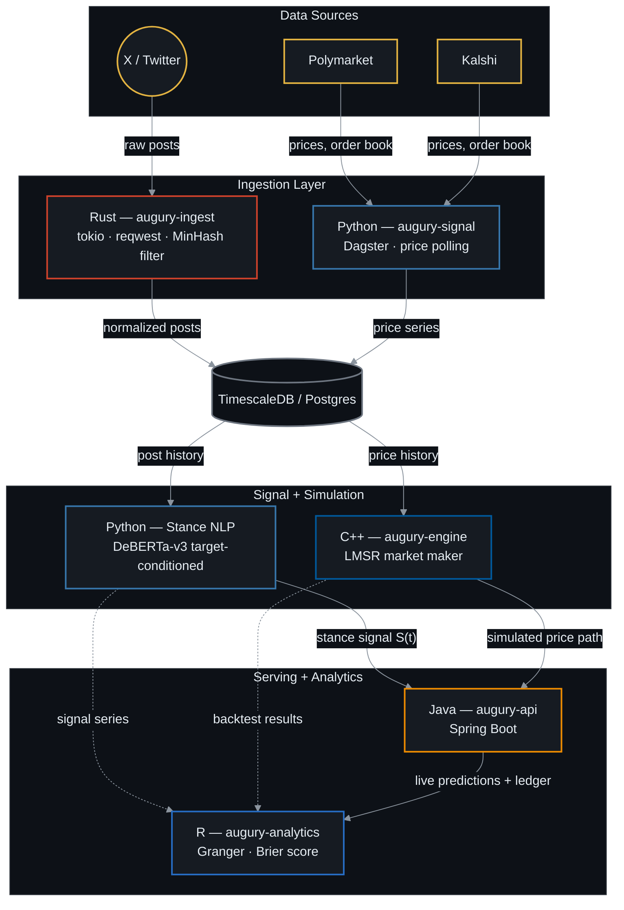

# Augury - Correlating Social Momentum with Prediction Markets

Augury is a quantitative pipeline designed to test whether social media sentiment leads or lags real-world prediction markets. It continuously streams and filters live posts from X (Twitter), processes the raw text into time-decayed stance probabilities, and maps those social signals against live order-book shifts from Polymarket and Kalshi to evaluate information efficiency.

Beyond simple observation, the system operates in two distinct modes. The statistical core evaluates Granger causality to see if social momentum actually predicts market movement, while a high-performance synthetic market engine uses Hanson’s Logarithmic Market Scoring Rule (LMSR) to simulate automated market maker (AMM) behavior based on those same NLP signals. The entire system is orchestrated across a distributed, polyglot architecture utilizing Rust, Python, C++, Java, and R to handle data ingestion, modeling, simulation, and serving at scale.

[](https://opensource.org/licenses/MIT)
[](https://www.rust-lang.org/)
[](https://www.python.org/)
[](https://isocpp.org/)
[](https://www.oracle.com/java/)
[](https://www.r-project.org/)

**Augury** is a distributed, multi-language quantitative sentiment and prediction engine. It continuously ingests social media signals from X (Twitter), transforms raw text into time-decayed stance probability vectors, and correlates social volume/sentiment against live market pricing on **Polymarket** and **Kalshi**.

The engine operates in two modes:

1. **Sentiment vs. Real Market Dynamics** — evaluates lead-lag relationships, information efficiency, and price-predictive signals between X data and actual order book shifts.
2. **Synthetic LMSR Market Engine** — simulates automated market maker (AMM) behavior using Hanson's Logarithmic Market Scoring Rule, driven by real-time NLP stance signals.

#### Contents

- [Architecture Overview](#architecture-overview)
- [Language Responsibilities](#language-responsibilities)
- [Mathematical Foundations](#mathematical-foundations)
- [High-Value Enhancements Included](#high-value-enhancements-included)
- [Repository Structure](#repository-structure)
- [Getting Started](#getting-started)
- [Roadmap & Implementation Phases](#roadmap--implementation-phases)
- [Potential Extensions](#potential-extensions)
- [Disclaimer](#disclaimer)

---

## Architecture Overview

The diagram below traces the full data flow, top to bottom: raw posts and market prices arrive at the top, get normalized and stored, pass through stance modeling and market simulation, and come out the other side as live predictions and statistical reports.



*Renders automatically on GitHub — no separate image file needed. Amber nodes are external data sources; every other color maps to a language in the table below.*

---

## Language Responsibilities

| Language | Module | Core Functionality | Key Stack / Libraries |
|---|---|---|---|
| **Rust** | `augury-ingest` | Fault-tolerant ingestion of X posts, MinHash deduplication, bot filtering, rate-limit queueing. | `tokio`, `reqwest`, `serde`, `sqlx` |
| **Python** | `augury-signal` | Kalshi/Polymarket polling, targeted DeBERTa-v3 stance classification, Dagster pipeline orchestration. | `transformers`, `torch`, `dagster`, `polars` |
| **C++20** | `augury-engine` | High-performance LMSR market maker, backtesting vectorization, synthetic order matching. | `CMake`, `Eigen`, `Catch2`, `fmt` |
| **Java** | `augury-api` | Enterprise API gateway, live paper-trading portfolio state, streaming WebSockets. | `Spring Boot 3`, `Project Reactor`, `Lombok` |
| **R** | `augury-analytics` | Econometric validation, lead-lag cross-correlations, Brier score calibration, Quarto reports. | `tidyverse`, `tseries`, `ggplot2`, `quarto` |

---

## Mathematical Foundations

### 1. Stance-Weighted Exponential Time-Decay Signal

Raw sentiment is insufficient for prediction markets; Augury extracts target-specific stance $\text{Stance}_i \in [-1, 1]$ (Bearish to Bullish) for event $E$. The aggregate social signal $S(t)$ at time $t$ uses half-life decay $\lambda$:

$$S(t) = \frac{\sum_{i=1}^{N(t)} w_i \cdot \text{Stance}_i \cdot e^{-\lambda (t - t_i)}}{\sum_{i=1}^{N(t)} w_i \cdot e^{-\lambda (t - t_i)}}$$

Where:
- $w_i = \ln(1 + \text{Followers}_i) \cdot (1 + \text{Engagements}_i)$ scales signal weight by user reach and post amplification.
- $\lambda = \frac{\ln(2)}{t_{half\_life}}$, with $t_{half\_life}$ set to 6 hours by default.

### 2. Information Lead-Lag & Granger Causality

To determine if social stance $S_t$ leads prediction market price $P_t$, we evaluate a vector autoregressive (VAR) model:

$$P_t = \alpha_0 + \sum_{j=1}^p \alpha_j P_{t-j} + \sum_{j=1}^p \beta_j S_{t-j} + \epsilon_t$$

We test the null hypothesis $H_0: \beta_1 = \beta_2 = \dots = \beta_p = 0$. Rejection ($p < 0.05$) indicates that social stance contains Granger-predictive information for future market price movements.

### 3. LMSR Automated Market Maker (C++ Engine)

For synthetic market simulation, price $p_k$ for outcome $k$ with outcome vector $\mathbf{q}$ is computed via Hanson's Logarithmic Market Scoring Rule with liquidity parameter $b$:

$$C(\mathbf{q}) = b \cdot \ln \left( \sum_{j=1}^K e^{q_j / b} \right), \quad p_k(\mathbf{q}) = \frac{e^{q_k / b}}{\sum_{j=1}^K e^{q_j / b}}$$

### 4. Forecast Calibration (Brier Score)

When market $M$ resolves at time $T$ to outcome $O \in \{0, 1\}$, forecast accuracy is quantified via the Brier Score:

$$BS = \frac{1}{N} \sum_{t=1}^N (S(t) - O)^2$$

---

## High-Value Enhancements Included

To move beyond baseline sentiment analysis, Augury includes four architectural enhancements:

1. **Entity-Targeted Stance over Naive Sentiment** — standard sentiment models fail on domain phrasing (e.g., "Candidate X drops out" is negative text sentiment, but bullish for "Will Candidate Y win?"). Augury uses DeBERTa fine-tuned for target-conditioned stance detection.
2. **Heuristic Bot & Spam Filtration (Rust Ingestion)** — applies streaming MinHash near-duplicate detection and account age/engagement checks in Rust before writing to storage, preventing spam rings from distorting social signals.
3. **Adaptive Decay Half-Lives** — dynamically accelerates signal decay ($\lambda$) during high-volatility event windows (e.g., debate hours or election nights) to prioritize immediate real-time posts over stale historical data.
4. **Order Book Depth & Spread Integration** — pulls bid-ask spreads and liquidity depth from public Polymarket/Kalshi unauthenticated REST endpoints to detect when high social momentum collides with thin order books (high signal-to-impact potential).

---

## Repository Structure

```text
augury/
├── apps/
│   ├── augury-ingest/       # [Rust] Async ingestion & bot filter
│   ├── augury-signal/       # [Python] Scrapers, NLP & Dagster pipelines
│   ├── augury-engine/       # [C++] LMSR market maker & backtesting engine
│   ├── augury-api/          # [Java] Spring Boot REST & WebSocket service
│   └── augury-analytics/    # [R] Granger causality & calibration reports
├── docker/                  # Docker Compose, TimescaleDB, & Redis configs
├── docs/                    # Architecture diagrams & API specification
├── Makefile                 # Master polyglot build workflow
└── README.md
```

---

## Getting Started

### Prerequisites

- Rust (1.75+)
- Python (3.11+) + `uv`
- C++20 compiler (g++-12 or clang-16+) + CMake (3.22+)
- Java JDK (21+) + Maven
- R (4.3+)
- Docker & Docker Compose

### 1. Environment & Infrastructure Setup

Clone the repository and initialize the time-series database:

```bash
git clone https://github.com/smparc/augury.git
cd augury

# Start TimescaleDB and Redis containers
docker-compose -f docker/docker-compose.yml up -d

# Verify database migrations
make db-migrate
```

### 2. Running Component Services

**Phase 1 — Rust Ingestion Layer**

Configure your X API bearer token in `.env` and launch the Rust ingest server:

```bash
export X_API_BEARER_TOKEN="your_token_here"
cd apps/augury-ingest
cargo run --release
```

**Phase 2 — Python Signal & Pipeline (Dagster)**

Execute market collection and fine-tuned stance classification:

```bash
cd apps/augury-signal
uv venv && source .venv/bin/activate
pip install -r requirements.txt

# Run Dagster UI for orchestrating scrapers and NLP transformations
dagster dev -f pipeline/orchestrator.py
```

**Phase 3 — C++ LMSR Engine Build & Benchmark**

Compile the high-performance backtesting engine:

```bash
cd apps/augury-engine
mkdir build && cd build
cmake -DCMAKE_BUILD_TYPE=Release ..
make -j$(nproc)

# Run benchmark suite
./bin/engine_benchmarks
```

**Phase 4 — Java API Layer**

Start the Spring Boot microservice to expose API endpoints:

```bash
cd apps/augury-api
./mvnw spring-boot:run
```

**Phase 5 — R Statistical Analytics & Report Generation**

Generate the lead-lag cross-correlation and Granger causality report:

```bash
cd apps/augury-analytics
Rscript -e "quarto::quarto_render('reports/lead_lag_analysis.qmd')"
```

---

## Roadmap & Implementation Phases

- [x] Phase 0: Architectural specification and repo setup.
- [ ] Phase 1: Python prototype (end-to-end, single-file exploratory notebook on Kalshi + X).
- [ ] Phase 2: Rust async streaming ingestion service with Postgres/TimescaleDB sink.
- [ ] Phase 3: DeBERTa-v3 target-specific stance pipeline with Dagster orchestration.
- [ ] Phase 4: R econometric reporting module (Granger causality, cross-correlations).
- [ ] Phase 5: C++ Hanson LMSR synthetic market maker and backtesting engine.
- [ ] Phase 6: Java Spring Boot backend API with WebSocket live-streaming updates.

---

## Potential Extensions

- **Confidence-weighted stance ensemble** — cross-check the DeBERTa stance model against a lightweight lexicon baseline (e.g. VADER) and use their disagreement rate as a per-post data-quality flag, rather than trusting a single classifier outright.
- **Liquidity as a control variable** — feed the order-book depth/spread data already being pulled into the Granger/VAR model directly, so "sentiment leads price" claims control for thin-book volatility instead of being confounded by it.
- **Walk-forward backtesting** — roll the C++ LMSR backtests forward in time (train on window *N*, test on *N+1*) instead of a single static split, and report how stable the liquidity parameter $b$ is across windows.
- **Live observability** — a small Grafana/Prometheus dashboard over TimescaleDB tracking ingestion lag, model inference latency, and API error rates. Cheap to add, and reads well as a systems-engineering detail in an interview.

---

## Disclaimer

**Educational and Research Purposes Only.** This repository is built strictly for educational, statistical research, and quantitative analysis purposes.

**Not Financial Advice.** The tools, algorithms, and simulated markets provided within this project do not constitute financial advice, trading recommendations, or an endorsement of any particular trading strategy.

**No Live Trading Execution.** The system is designed as an analytical pipeline and a synthetic market simulator. It does not execute live financial trades on Polymarket, Kalshi, or any other prediction market, nor does it interact with real funds or exchange accounts. Use of this codebase should comply with all local regulations and platform terms of service regarding data ingestion and scraping.